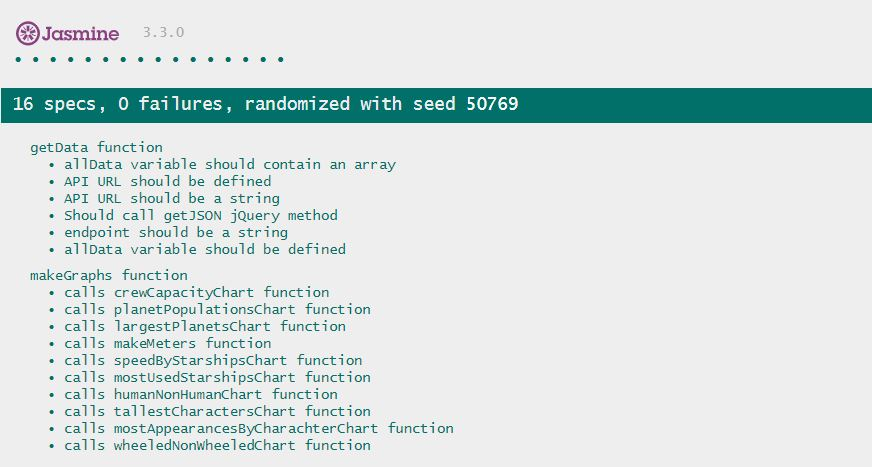

# Interactive Data Dashboard

A data dashboard that visualizes a dataset retrieved from the [Star Wars API](https://swapi.co/). 

Built for Milestone Project no.2 in the Full Stack Software Development bootcamp at Code Institute, in the Interactive Frontend Development module.
 
## UX
 
This application was built to visualize selected data from the Star Wars universe and to allow users to interact with that data to explore the dataset in question.

User Stories:
- As a user I can see the top 20 characters who appeared in the most movies by bar chart
- As a user I can see the tallest and smallest characters spread across a line graph
- As a user I can see the most used starships across all films, displayed across a row chart
- As a user I can compare the maximum atmospheric speed of starships across a bar chart
- As a user I can see the cargo capacity of all vehicles displayed across a line graph
- As a user I can see the number of wheeled and non-wheeled vehicles displayed over a pie chart
- As a user I can see the 10 largest planets displayed on a row chart
- As a user I can see the number of human characters against the number of non-human characters on a pie chart
- As a user I can interact with a chart and any related charts on the dashboard will also change accordingly to highlight my selections
- As a user I can easily reset all charts whenever necessary to begin exploring the dataset again from the beginning

This site was based on an initial mockup designed in Adobe XD and an exported image for this mockup can be seen below. The image file itself as well as the XD project file can be found in the main project folder:

## Features
 
#### Existing Features
- Feature 1 - View numerous Pie Charts, Line Graphs, Bar Charts and Row Charts that visualize various aspects of a detailed Star Wars dataset.
- Feature 2 - Click on elements to interact with the charts. 
- Feature 3 - Reset all charts when necessary.

## Technologies Used

Languages, frameworks, libraries, and any other tools used to construct this project. 

- HTML 5
    - This project uses **HTML** to structure the content of the website.
- CSS 3
    - The project uses **CSS** to add fonts and some additional styling to the site.
- [Bootstrap](https://getbootstrap.com/)
    - This project uses **Bootstrap** to assist with responsive behaviour and to provide a grid framework.
- [Bootswatch](https://bootswatch.com/)
    - **Bootswatch** was used to provide a theme for Bootstrap. The 'Lux' theme was used for this site. 
- JavaScript
    - The project uses **JavaScript** to add animations, retrieve data from the third-party API and to build the charts displayed on the dashboard.
- [jQuery](https://jquery.com/)
    - This project uses **jQuery** to assist in making asynchronous requests for third-party data and also to simplify DOM manipulation.
- [D3.js](https://d3js.org/)
    - The project uses **D3.js** to for data visualization.
- [DC.js](https://dc-js.github.io/dc.js/)
    - The JavaScript library **DC.js** was used on top of D3.js to build reactive charts that provide instant feedback to user interaction.
- [Crossfilter](http://square.github.io/crossfilter/)
    - The **Crossfilter** JavaScript library was used to work with a multidimensional dataset and to support chart interaction.
- [CountUp.js](https://inorganik.github.io/countUp.js/)
    - This simple **CountUp.js** JavaScript library was used to create number animations.
- [Intro.js](https://introjs.com/)
    - **Intro.js** was used to provide an introduction to the user and a tour of the features of the site.

## Testing

This project was developed incrementally with continuous use of `console.log` to repeatedly check the changes made on the site and to ensure all changes to source code were providing the desired outcome in the browser. The site was build using Google Chrome browser (version 71) and then later tested in other browsers.

This project was tested for responsiveness using the Chrome Developer Tools mobile device simulator. It was also viewed on physical Samsung Galaxy A5 (2017) mobile device to ensure good responsive behaviour. The site was also tested in Mozilla Firefox (version 65) and Microsoft Edge (version 17) browsers to ensure appearance and functionality of the site was as expected across all 3 of these browsers.
As this project is a data dashboard it designed for desktop or large-screen viewing, however the containers in which the charts are rendered are responsive and scrollbars have been added to allow the charts be viewed as much as possible on smaller screens where possible.

HTML markup and CSS styles were checked using the W3C Validation Tool [here](http://validator.w3.org) and both HTML and CSS files passed without error.

There is no actual user input on the site so there was no form elements and no user input validation required.

All users stories defined at the outset were checked and all were correctly displayed at all times as well as being reactive to user interaction and with each chart being interactive with all related charts.

There are no errors being displayed in the Chrome Dev Tools console when the site loads and when users interacts with the dashboard.

The site was also audited with Chrome Dev Tools' Lighthouse. Using the Applied Fast 3G throttling, the results were good and were as follows on the audit report:

| Performance | Accessibility | Best Practices | SEO |
| :---------: | :------------:|:--------------:|:---:|
| 86          | 88            | 87             | 89  |

(_Progressive Web App audit scoring has been removed as the site was not intended to operate as a PWA_.)

All the JavaScript code written to date does not explicitly return any values as such and simply completes operations such as pushing data to a global array, adding properties to a global object, incrementing global variables or calling functions to build charts on the dashboard. 
The two main functions defined were `getData()` and `makeGraphs()` and tests were run to ensure the `getData()` function calls jQuery's `getJSON()` method which is used internally, and also to ensure the `makeGraphs()` function calls all of the relevant functions to create all charts for the dashboard.
Tests were also run to ensure that the arguments passed in to the `getData()` function were of type `string` and that variable that is declared to hold all data returned by the is of type `array`.
Results of these test using Jasmine can be seen on the image below (test files can also be found inside the 'jasmine' folder in the project repo):

## Deployment

GitHub was used for version control and to host the code by pushing all code to the repo on GitHub.

This project was then deployed on GitHub Pages by simply accessing the project's settings page then selecting the Master branch in the drop-down menu for deploying the project on GitHub Pages.

The live project can be viewed [here](https://kes2401.github.io/data-dashboard/).

## Credits

#### Acknowledgements

- The Star Wars font used in the main heading is called 'Star Jedi' and was downloaded from [here](https://www.dafont.com/star-jedi.font).
- The code used to run CountUp.js on the record counters was taken from the brief demo on the [CountUp.js website](https://inorganik.github.io/countUp.js/) and then amended slightly for the purposes of this project.
- In researching how to properly understand and implement the functionality and features provided by DC.js and Crossfilter.js the following sites and pages were regularly referenced:
    - [Examples of using dc.js](http://dc-js.github.io/dc.js/examples/) on the DC.js site
    - [DC.js Tutorial](https://www.tutorialspoint.com/dcjs/) on TutorialsPoint
    - [Getting to know Crossfilter](https://animateddata.co.uk/articles/crossfilter/) article by Peter Cook
    - [Crossfilter Tutorial](http://blog.rusty.io/2012/09/17/crossfilter-tutorial/) by Rusty Klophaus