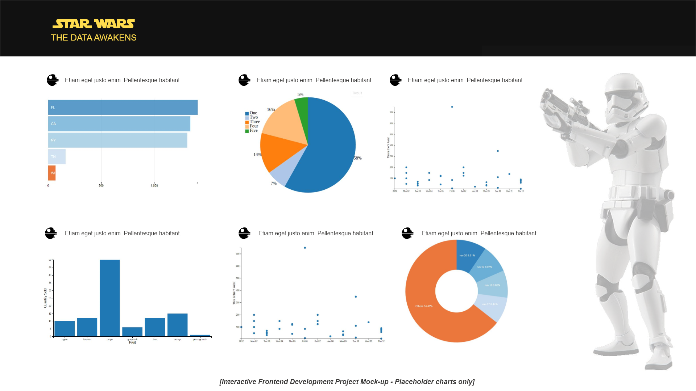

# Interactive Data Dashboard

A data dashboard that visualizes a dataset retrieved from the [Star Wars API](https://swapi.co/). 

Built for Milestone Project no.2 in the Full Stack Software Development bootcamp at Code Institute, in the Intereactive Frontend Development lesson.
 
## UX
 
This application was built to visualize selected data from the Star Wars universe and to allow users to interact with that data to explore the dataset in question.

User Stories:
- As a user I can see the top 20 characters who appeared in the most movies by bar chart
- As a user I can see the tallest and smallest characters spread across a line graph
- As a user I can see the most used starships across all films, displayed across a row chart
- As a user I can compare the maximum atmospheric speed of starships across a bar chart
- As a user I can see the cargo capacity of all vehicles displayed across a line graph
- As a user I can see the number of wheeled and non-wheeled vehicles displayed over a pie chart
- As a user I can see the 10 largest planets displayed on a row chart
- As a user I can see the number of human characters against the number of non-human characters on a pie chart
- As a user I can interact with a chart and any related charts on the dashboard will also change accordingly to highlight my selections
- As a user I can easily reset all charts whenever necessary to begin exploring the dataset again from the beginning

This site was based on an initial mockup designed in Adobe XD and an exported image for this mockup can be seen below. The image file itself as well as the XD project file can be found in the main project folder:

## Features
 
### Existing Features
- Feature 1 - 
- Feature 2 - 
- Feature 3 - 
- Feature 4 - 
- Feature 5 - 

## Technologies Used

Languages, frameworks, libraries, and any other tools used to construct this project. 

- HTML 5
    - This project uses **HTML** to structure the content of the website.
- CSS 3
    - The project uses **CSS** to add styling and to adjust the default styling of components provided by the Bootstrap framework. It was also used to add media queries to assist in the responsive behaviour of the site.
- [Bootstrap](https://getbootstrap.com/)
    - This project uses **Bootstrap** to assist with responsive behaviour and to provide a grid framework.
- JavaScript
    - The project uses **JavaScript** to add some interactive behaviour, particularly while using the jQuery library.
- [jQuery](https://jquery.com/)
    - This project uses **jQuery** to provide some minor interactive features such as page scrolling and form submission modal handling
- [Bootswatch](https://bootswatch.com/)
    - Lux theme for **Bootstrap** 
- [D3.js](https://d3js.org/)
    - A JacaSvript library used for visualizing data.
- [DC.js](https://dc-js.github.io/dc.js/)
    - A charting library build on top of D3.js to build reactive charts that provide instant feedback to user interaction
- [Crossfilter](http://square.github.io/crossfilter/)
    - A JavaScript library used to explore multidimensional datasets
- [CountUp.js](https://inorganik.github.io/countUp.js/)
    - A simple JavaScript library used to create number animations
- [Intro.js](https://introjs.com/)
    - Used to provide an introduction to user with a tour of the features of the site 

## Testing

This project was developed incrementally with continuous checking to ensure all changes to source code were providing the desired outcome. The site was build using Google Chrome browser (version 71) for this purpose, then later tested in other browsers.

This project was tested for responsiveness using the Chrome Developer Tools mobile device simulator. It was also viewed on physical Samsung Galaxy A5 (2017) mobile device to ensure good responsive behaviour. The site was also tested in Mozilla Firefox (version 65) and Microsoft Edge (version 17) browsers to ensure appearance and functionality of the site was as expected across all 3 of these browsers.

HTML markup and CSS styles were checked using the W3C Validation Tool [here](http://validator.w3.org) and both HTML and CSS files passed without error.

The site was audited with Chrome Dev Tools' Lighthouse. Using the Applied Fast 3G throttling, the results were as follows on the first audit report:

| Performance | Progressive Web App | Accessibility | Best Practices | SEO |
| :---------: |:-------------------:| :------------:|:--------------:|:---:|
| 86          | 50                  | 88            | 87             | 89  |

While ...

## Deployment

GitHub was used for version control and to host the code by pushing all code to the repo on GitHub.

This project was then deployed on GitHub Pages by simply accessing the project's settings page then selecting the Master branch in the drop-down menu for deploying the project on GitHub Pages.

The live project can be viewed [here](https://kes2401.github.io/data-dashboard/).

## Credits

### Content

### Media

### Acknowledgements
